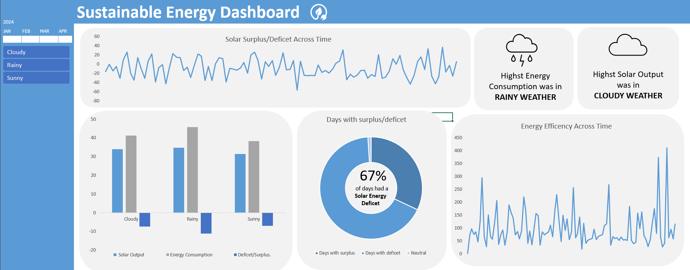

# Sustainable_Energy_Monitoring Dashboard

## Overview
This excel dashboard is designed to track and analyze solar energy output, energy consumption, weather conditions, and energy efficiency over a period of time. The data helps in understanding the relationship between weather conditions and energy metrics, and in identifying days with energy surplus or deficit.

## The Dashboard

## Key Metrics
- **Days with Surplus**: Days when solar energy output exceeded energy consumption.
- **Days with Deficit**: Days when energy consumption exceeded solar energy output.
- **Neutral Days**: Days when solar energy output equaled energy consumption.

## Usage
This dashboard can be used to:
- Monitor daily solar energy production and energy consumption.
- Analyze the impact of weather conditions on energy metrics.
- Identify trends and patterns in energy efficiency.
- Make informed decisions for improving energy sustainability.

## Notes
- The dashboard includes slicers for filtering data by weather conditions and dates.
- The file is compatible with Excel 2013 or higher.
- Do not move or resize the timeline slicer to ensure proper functionality.

## Conclusion
This dashboard provides valuable insights into energy production and consumption patterns, helping users to optimize energy usage and enhance sustainability efforts.
